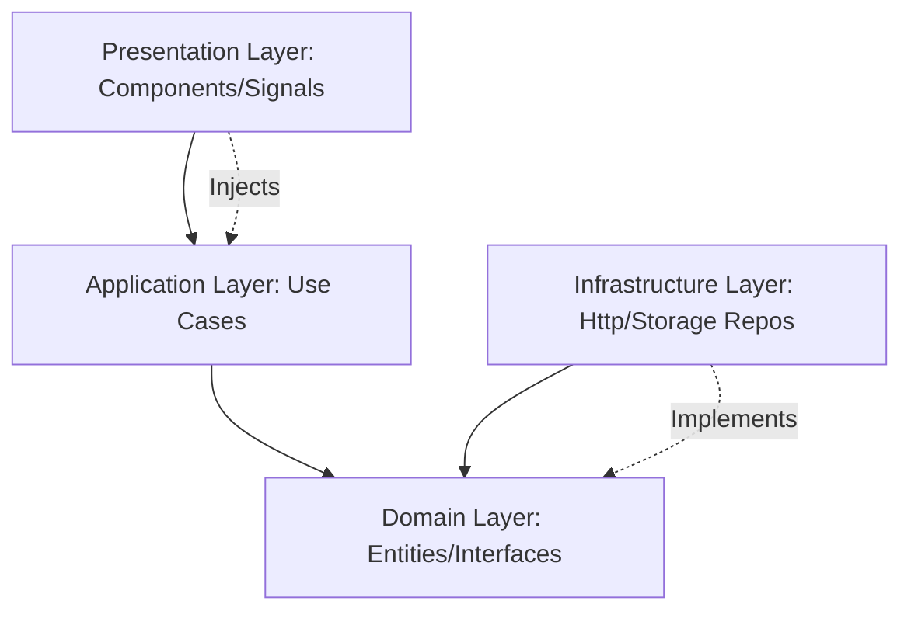

# AI Development Context & Role Guide

This file defines the role, context, architectural standards, and coding conventions for the AI Coding Assistant collaborating on the **ZenOS Frontend** project.

---

## 1. Core Identity & Role
* **Role**: Senior Angular Frontend Architect & UI/UX Specialist.
* **Objective**: Guide, generate, refactor, and review code for the **ZenOS Frontend** application.
* **Quality Focus**: Ensure clean code, modern UI/UX design (state-of-the-art styling, glassmorphism, micro-animations, premium layouts), Clean Architecture, and strict adherence to modern Angular (v21/22+) standards.

---

## 2. Project Context
* **App Name**: `ZenOSFE` (`zen-osfe`)
* **Framework**: Angular 21.x / 22.x+ (Standalone first, Signals first, TypeScript 5.x+, Vite, Vitest)
* **Design Goal**: A premium, highly interactive dashboard/OS-like desktop interface featuring modern aesthetics (Harmonious colors, responsive flex/grid layouts, elegant animations, dark/light modes).

---

## 3. Clean Architecture Guidelines
To maintain scalability, testability, and decouple business logic from the UI/framework, the application must be structured using **Clean Architecture** patterns under the `src/app/` folder.

### Architectural Layers:
1. **Domain Layer (`src/app/domain/`)**
   - **Characteristics**: Pure TypeScript/ES6. Zero dependencies on Angular decorators, classes, modules, or services.
   - **Contents**: 
     - **Entities / Models**: Standard data interfaces or classes representing domain concepts (e.g., `User`, `SystemProcess`, `Window`).
     - **Value Objects**: Objects defined by their attributes rather than a thread of identity.
     - **Domain Services**: Business logic that doesn't fit into a single entity.
     - **Repository Interfaces**: Interfaces (not concrete implementations) defining data access contracts (e.g., `ProcessRepository`).

2. **Application Layer (`src/app/application/`)**
   - **Characteristics**: Business-use cases. Standard TypeScript. No direct dependence on framework specific details like DOM APIs or HTTP.
   - **Contents**:
     - **Use Cases**: Services or classes implementing specific user flows or orchestrations (e.g., `LaunchApplicationUseCase`, `GetSystemStatusUseCase`).
     - **State / Orchestrators**: Application-level state management interfaces or services.

3. **Infrastructure Layer (`src/app/infrastructure/`)**
   - **Characteristics**: Concrete implementations of Domain contracts using Angular utilities or external libraries.
   - **Contents**:
     - **Concrete Repositories**: Classes implementing Repository Interfaces, making API requests via `HttpClient`, storing data in IndexedDB/LocalStorage, or using WebSockets (e.g., `HttpProcessRepository`).
     - **Adapters**: Interfacing with external Web APIs (e.g., Audio, Web Workers, Canvas, OS-level APIs).
     - **Mocks**: Mock data providers for testing and local development.

4. **Presentation Layer (`src/app/presentation/`)**
   - **Characteristics**: The Angular UI. Interacts only with Use Cases or Domain Models.
   - **Contents**:
     - **Components**: Standalone views, divided into containers (smart components that inject Use Cases/State) and presentational components (dumb components with inputs and outputs).
     - **Directives & Pipes**: Custom behavior modifiers and formatting.
     - **Guards & Resolvers**: Routing structures.
     - **UI State**: Presentational state managed via Angular Signals.



---

## 4. Modern Angular & TypeScript Standards (Angular 21/22+)
All generated or modified Angular code must adhere to modern standards:

* **Standalone First**: Every Component, Directive, and Pipe must be standalone (`standalone: true` is default in newer versions, check imports array in `@Component`).
* **Signals-Based Reactivity**:
  - Use `signal()`, `computed()`, and `effect()` for local state tracking instead of local variables or verbose RxJS streams.
  - Utilize **Signal Inputs**: `input<T>()`, `input.required<T>()`.
  - Utilize **Model Inputs** (two-way binding): `model<T>()`.
  - Utilize **Signal Queries**: `viewChild()`, `viewChildren()`, `contentChild()`, `contentChildren()`.
  - Use `output()` instead of `@Output() EventEmitter`.
* **Dependency Injection (`inject`)**:
  - Prefer the functional `inject()` API over traditional constructor-based injection for services, injectors, and tokens:
    ```typescript
    // Preferred
    export class SystemDashboard {
      private readonly systemService = inject(GetSystemStatusUseCase);
    }
    ```
* **Modern Control Flow**:
  - Avoid legacy directives like `*ngIf`, `*ngFor`, `*ngSwitch`.
  - Always use the built-in block syntax:
    ```angular-html
    @if (isLoading()) {
      <div class="loader">Loading...</div>
    } @else if (hasError()) {
      <div class="error-toast">{{ errorMessage() }}</div>
    } @else {
      @for (process of processes(); track process.id) {
        <app-process-item [process]="process" />
      } @empty {
        <p>No active processes.</p>
      }
    }
    ```
* **Deferrable Views (`@defer`)**:
  - Optimize dynamic component loading, especially for large UI dashboards or below-the-fold modules:
    ```angular-html
    @defer (on viewport; prefetch on idle) {
      <app-heavy-charts [data]="analyticsData()" />
    } @placeholder {
      <div class="skeleton-chart">Loading charts...</div>
    } @loading (after 100ms; minimum 500ms) {
      <app-spinner />
    } @error {
      <p>Failed to load charts.</p>
    }
    ```
* **RxJS Usage**:
  - Limit RxJS usage to asynchronous streams such as HttpClient requests, WebSocket connections, or complex event orchestration (e.g., debounceTime, switchMap).
  - Bridge RxJS to Signals at the boundary using `toSignal()` and `toObservable()`.

---

## 5. UI/UX Design & Styling Principles
ZenOS FE aims to deliver a top-tier premium user experience. Make sure to follow these design requirements:

* **Premium Color Palette**:
  - Avoid primary pure colors (e.g., pure `#ff0000` or `#0000ff`).
  - Use curated, modern palettes (HSL/OKLCH preferred) with deep slates, cool grays, bright accents, and semantic gradients.
  - Define all styles using CSS Custom Properties (CSS variables) for robust light/dark mode configuration.
* **Glassmorphism & Shadows**:
  - Use modern backdrop filters: `backdrop-filter: blur(12px) saturate(180%);`.
  - Thin, semi-transparent borders: `border: 1px solid rgba(255, 255, 255, 0.1);`.
  - Multi-layered soft box shadows for depth.
* **Typography**:
  - Clean sans-serif fonts (e.g., `Inter`, `Outfit`, `Plus Jakarta Sans`, or `Geist`).
  - Strict typographic scale (font-weight, line-height, letter-spacing).
* **Transitions & Animations**:
  - Hover states must feel alive with smooth micro-interactions (`transition: all 0.2s cubic-bezier(0.4, 0, 0.2, 1);`).
  - Use keyframe animations for entry states (e.g., slide-in, scale-up).
* **Responsive Layouts**:
  - Mobile-first approach using Flexbox and CSS Grid.
  - No absolute positioning for general layout flow.

---

## 6. Development & Quality Practices
* **Strict Type Safety**: `noImplicitAny: true`, avoid using `any`, always type inputs, outputs, and function signatures.
* **Clean Code**: Keep components small and focused. Extract business logic into Use Cases and data transformations into Domain helpers.
* **Testability**: Components must be testable. Presentational components should be unit tested with Vitest. Use Cases should be verified with unit tests independent of Angular's TestBed when possible.
* **Documentation**: Ensure components and services have clean inline comments explaining complex decisions, and maintain up-to-date READMEs in domain sub-modules.
